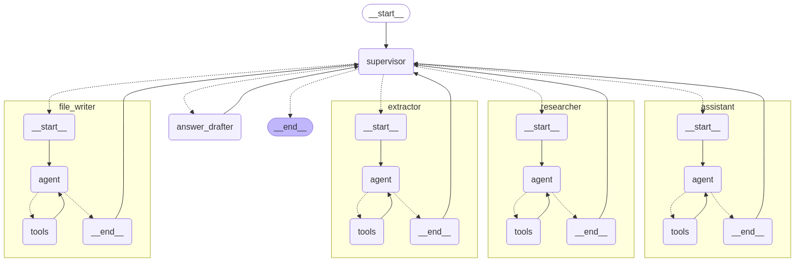

# Deep Research AI Agentic System

Deep Research AI Agentic System is a multi-agent framework designed to perform deep online research by crawling websites using Tavily. The system leverages LangChain and LangGraph frameworks to manage a dual-agent (or multi-agent) setup. One agent focuses on gathering research and data collection while another specializes in drafting clear, structured answers based on the gathered information. Additional agents handle file management and LLM-based queries.

## Features

- **Multi-Agent Architecture:**  
  Separate agents for research, data extraction, answer drafting, LLM query handling, and file management.

- **Dynamic Workflow Coordination:**  
  A supervisor node dynamically routes tasks among the agents based on user inputs and agent outputs.

- **Tavily Integration:**  
  Uses Tavily's search and extraction tools to fetch and extract detailed online content.

- **LangChain & LangGraph Powered:**  
  Leverages powerful frameworks to structure conversations and manage stateful multi-step workflows.

- **File Management:**  
  Integrated file tools allow saving and reading of research data locally.

## Architecture

The system’s architecture is structured as a state graph with the following key components:

- **Supervisor Node:**  
  Orchestrates the flow between different agents based on the conversation state and user inputs.

- **LLM Agent:**  
  Provides direct answers for queries that do not require external data, using GPT-4 via LangChain.

- **Research Agent:**  
  Uses Tavily to conduct online searches and gather initial research data.

- **Extractor Agent:**  
  Extracts detailed content from the URLs provided by the research agent, leveraging Tavily’s extraction API.

- **Answer Drafter Agent:**  
  Summarizes and organizes the gathered research data into a coherent answer.

- **File Writer Agent:**  
  Manages file operations, such as saving the results or intermediate data.

Below is an example diagram (generated as `graph.png`) that visually represents the workflow:



## Installation

### Prerequisites

- Python 3.8 or later
- API keys for:
  - [OpenAI](https://platform.openai.com/) (set as `OPENAI_API_KEY`)
  - [Tavily](#) (set as `TAVILY_API_KEY`)

### Setup

1. **Clone the Repository:**
   ```bash
   git clone https://github.com/your_username/deep-research-agentic-system.git
   cd deep-research-agentic-system
   ```

2. **Create a Virtual Environment and Activate It:**
   ```bash
   python -m venv venv
   source venv/bin/activate   # On Windows: venv\Scripts\activate
   ```

3. **Install Dependencies:**
   ```bash
   pip install -r requirements.txt
   ```

4. **Configure Environment Variables:**
   Create a `.env` file in the root directory and add:
   ```ini
   OPENAI_API_KEY=your_openai_api_key
   TAVILY_API_KEY=your_tavily_api_key
   ```

## Usage

Run the main loop to start interacting with the system:
```bash
python main.py
```

- The system will prompt for user input.
- Type your query and press Enter.
- To exit, type `quit`, `exit`, or `q`.

## Code Structure

- **`main.py`:**  
  Contains the main execution loop and graph streaming logic.

- **Agent Nodes:**  
  - **Supervisor Node:** Routes the conversation between agents.
  - **LLM Node:** Handles direct LLM-based responses.
  - **Research Node:** Gathers online research data.
  - **Extractor Node:** Extracts detailed content from search results.
  - **Answer Drafter Node:** Summarizes and structures the research.
  - **File Writer Node:** Handles file read/write operations.

- **Tools:**  
  - **LLM Tool:** Facilitates LLM calls.
  - **Research Tool:** Integrates with Tavily to perform online searches.
  - **Extractor Tool:** Extracts content from fetched URLs.
  - **File Management Toolkit:** Provides file operations (read, write, list).

- **Graph Visualization:**  
  The workflow graph can be visualized and is saved as `graph.png`.

## Contributing

Contributions are welcome! Please fork the repository and submit a pull request with your changes.

## License

This project is licensed under the MIT License. See the [LICENSE](LICENSE) file for more details.

## Contact

For any questions or suggestions, please open an issue on GitHub or contact the project maintainer.
